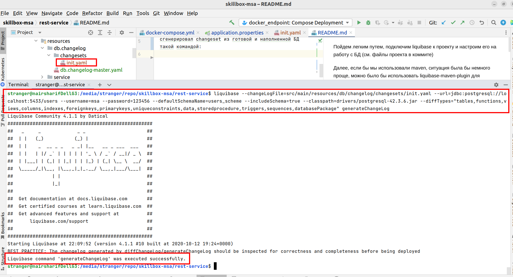

### 2.2 Установить сервисы в Kubernetes с помощью helm в среды разработки
### Задача
В этой задаче нужно создать chart-файл, который будет описывать конфигурацию вашего приложения, и установить его в Kubernetes. Предусмотрите возможность его разворачивания в любой среде: в среде разработки, тестирования и в продуктивной. Среда должна передавать вашему приложению всю информацию о его работе: его нахождении базы данных, системы кеширования очередей, способов и правил логирования. Такую информацию приложение может получить из env-переменных. Они позволяют ему понять, как настроена среда разработки.

Помните, что созданный вами chart-файл тоже может версионировать и служить артефактом для управления приложением.

При необходимости вы можете создать несколько файлов для каждой среды разработки. Эти файлы лежат в директории chart. Вот как это делается:

#### Этапы работы над задачей
1. Создайте chart-файл, описывающий конфигурацию.
2. Установите с помощью chart-файла приложение на стенд разработки и тестирования.
3. Сохраните файл в корне репозитория вашего приложения в директории .chart.

#### Критерии оценки
- Приложение успешно разворачивается, применяя конфигурацию из chart-файла.
- Сhart-файлы находятся в репозитории в папке .chart.

### 2.9 Создать тестовые стенды (Dev, prePROD)

### Задача
В этой задаче необходимо создать два namespace в Kubernetes, которые будут отвечать за dev-стенд и препрод.

#### Этапы работы над задачей
1. Создайте с помощью kubctl [фамилия]dev, проверьте его доступность.
2. Создайте с помощью kubctl [фамилия]prePRDO, проверьте его доступность.
3. Проверьте ваши namespace в Kubernetes.

#### Критерии оценки
- В нашем Kubernetes появились два ваших namespace.
- В них получается устанавливать артефакты.