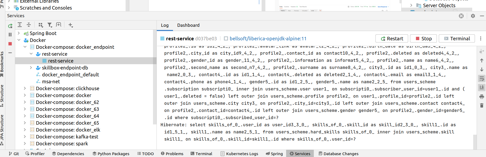

При решении задачи я использовал заготовку из предыдущей задачи, дополнив ее уже все недостающими репозиториями для всех созданных ранее сущностей в БД с учетом их связей

Для проверки работы репозиториев я создал необходимые сервисы и контроллер/методы в контроллере. Дополнительный контроллер сделан из соображения, что атрибуты пользователя на самом деле универсальны и потенциально могут использоваться не только для него. Затем проверил работу сервисов в Postman, все ок, например:

и аналогично проверил для всех новых методов в контроллере и всех репозиториев, также проверил, что изменения в коде не сломали старые методы