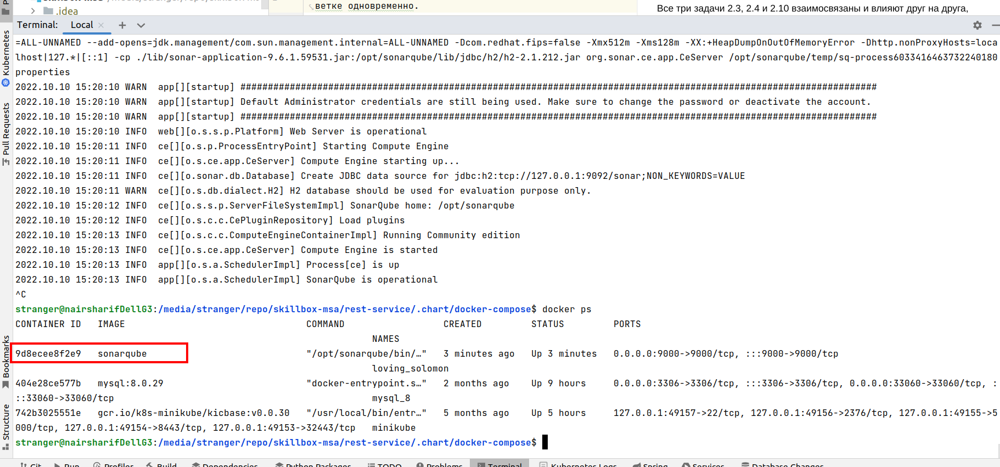

Задание выполнено с оговоркой - я предлагаю принять более техничное, на мой взгляд, решение.

Давайте, представим себе, чтобы мы действительно собрали docker образ на базе какой-то операционной системы, добавили в него установку jdk, загрузку нашего jar файла и entrypoint с его запуском при запуске контейнера с этим образом. Немедленно мы получаем следующий недостаток - при всяком изменении jar файла (отладка и исправление ошибок, запуск новой версии микросервиса) нам потребуется пересобрать образ с новым jar файлом. Это избыточные действия, можно сделать проще, и результат будет намного легче в обслуживании.

Необходимо запустить контейнер из любого походящего готового образа ОС из https://hub.docker.com, например, https://hub.docker.com/r/bellsoft/liberica-openjdk-alpine/tags?page=1&name=11. При этом достаточно подключить к контейнеру volume, где будет лежать наш jar файл сервиса, а опцией docker command или в секции command в файле docker-compose.yml запишем java -jar "путь к нашему jar файлу внутри контейнера". В результате мы получим тот же самый результат, но с огромным преимуществом - не нужно пересобирать образ при каждом изменении версии jar файла, достаточно поместить новую версию в смапленный volume вместо старой, а это намного легче и быстрее, время на обслуживание сервиса сократится

Для подготовки jar достаточно добавить в build.gradle

```groovy
tasks.named('bootJar') {
	launchScript()
}
```
и пересобрать сервис. После сборки jar будет находиться в каталоге rest-service/build/libs, нужно перенести его, например, в каталог ресурсов, так как build находится в .gitignore

Необходимо также перенастроить адрес для подключения к БД в связке контейнеров - он будет теперь другой, см. [docker_endpoint/docker-compose.yml](docker_endpoint/docker-compose.yml)

Результаты работы связки сервисов:

