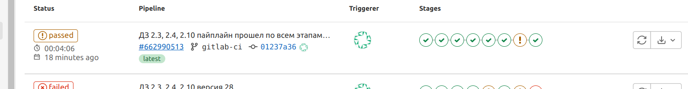
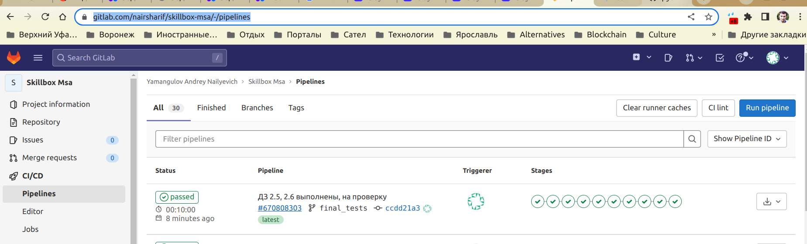

При тестировании выявлены следующие закономерности и особенности работы testcontainers совместно с liquibase:
1. При выставлении контрольной точки останова в debug режиме и подключении к БД видим, что база успешно создается и миграции в БД успешно проливаются
2. При тестировании работы с таблицами, если требуется добавить значение в таблицу с GenerationType.IDENTITY на поле Integer id - testcontainers НЕ УМЕЕТ правильно вычитать из последовательности последующий корректный номер id для тех записей, которые залиты в БД из liquibase, и всегда пытается вставить записи, начиная с номера 1. Если в БД, например, было 3 записи, то только на 4 раз запись вставится корректно:

Поэтому для обхода проблемы ставим на каждый из 3-х таких тестов аннотацию @ReapetedTest(n + 1) (по числу записей в соответствующей таблице БД, которые нам явным образом известны из миграций, или же можно посмотреть их кол-во в БД в точках останова). Есть варианты убрать вручную из changesets id в insert или добавить в него сдвиг начала последовательности, но это также требует вручную посмотреть nextval в БД и никаких преимуществ не дает.
После этого при запуске тестов мы все равно увидим ошибки непрохождения каждого из этих тестов указанное число раз, но на последний раз нужная запись появится в БД. Отловить ошибку можно только через try-catch, к сожалению, для первых неправильных повторов, так как mockMVC здесь ничего не возвращает, ни статусов, ничего - просто вылетает ошибка sql, для которой я не нашел, как ее "красиво" обработать в тесте. В принципе, решение все равно приемлемое для такой сложной ситуации.
Мне не хотелось упрощать проект, сделанный на первом этапе, а добиться результата с имеющимися сложными условиями, что и выполнено.
3. В результате тесты проходят успешно

