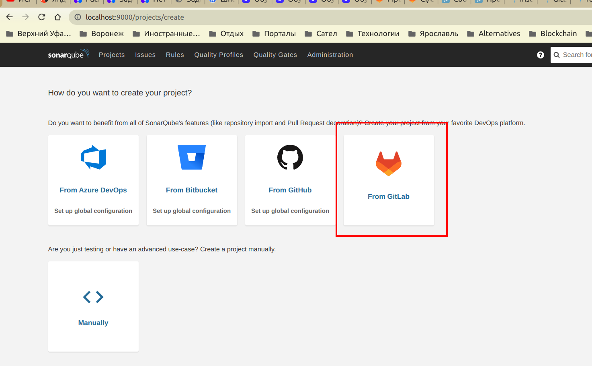

Для решения задачи выберем максимально экономный путь. Копируем файл [docker-compose.yml](docker_endpoint/docker-compose.yml) в каталог [.chart](.chart) и немного модифицируем его для работы с [Kompose](https://kubernetes.io/docs/tasks/configure-pod-container/translate-compose-kubernetes/#kompose-convert), для того, чтобы иметь возможность конвертировать его в чарт для Helm. (Придерживаемся принципа - если есть удобный инструмент для выполнения задачи - нужно пользоваться им, а не делать все вручную!). А именно - понижаем версию docker-compose.yml до 3.3 (так рекомендует документация, версии выше пока не поддерживаются) и добавляем labels, необходимые для настройки конвертации (см. итоговый файл [docker-compose.yml](.chart/docker-compose.yml)). А также добавляем секцию для сервиса rest-service с образом rest-service:0.0.1, который мы получаем из нашего приложения путем подключения к нему плагина jib:

и выполнения затем команды `gradle jibDockerBuild`, что также можно выполнить через Intellij Idea:

Затем выполняем конвертацию для Helm:

После этого удалим лишние незаполненные поля sources и home в файле [Chart.yml](.chart/docker-compose/Chart.yaml)

Выполним для проверки установку чарта в minikube:

Проверим состояние кластера:

Обратим внимание, что не все pod сразу могут перейти в состояние ready, например, приложение может стартовать слишком рано, пока БД еще не готова, через несколько минут это поправится.

Чтобы удобно было работать, настроим port forwarding в Intellij Idea и убедимся, что все таблицы создались и миграция в БД пролилась:

