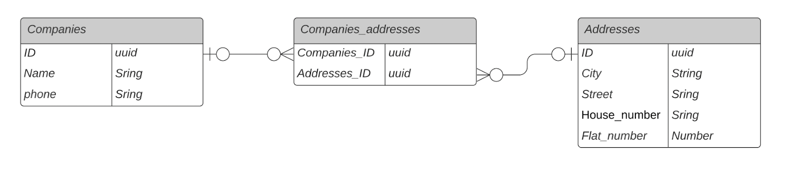

**Задача**

В этой задаче необходимо подготовить DDL-скрипты, которые будут разворачивать нашу базу данных, на основании ER-диаграммы.



Напишите необходимые таблицы на синтаксисе DDL для PostgreSQL.

Создание таблицы выглядит следующим образом:

```
CREATE TABLE [IF NOT EXISTS] table_name (

column1 datatype(length) column_contraint,

column2 datatype(length) column_contraint,

column3 datatype(length) column_contraint

);
```


**Этапы работы над задачей**

1.Создайте отдельную базу данных для таблиц и назовите её users.

2.В самой базе данных создайте схему для вашего сервиса. Назовите её users_scheme.

3.После этого создайте все таблицы, указанные в ER-диаграмме в этой схеме.


**Критерии оценки:**

1.В PostgreSQL создана база users.

2.В базе users создана схема users_scheme.

3.В схеме созданы все таблицы, которые были указаны на ER-диаграмме со всеми типами данных.


**Формат сдачи**

В качестве решения вам нужно загрузить скрипт (файл в формате sql).