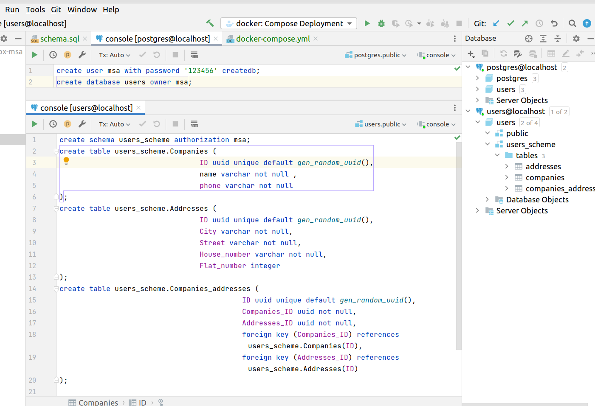

На самом деле, задание немножечко "с подвохом", а именно - если мы действительно хотим сделать все, как положено на продуктиве, то нам обязательно нужен отдельный пользователь с правами к новой БД. Соответственно, мы должны создать пользователя и новую БД, подсоединившись к БД с правами суперпользователя. Это первый скрипт sql. Затем следует переподключиться к postgres под новым созданным пользователем именно к новой созданной БД (это нужно для того, чтобы новая схема создавалась именно в базе users, так как схема по умолчанию создается в той БД, к которой мы уже подключены). А затем уже создавать схему и таблицы со связями - это уже второй скрипт sql. То есть нам нужно дважды подключиться (можно через psql, но я подключался в Intellij Idea через создание двух data sources), и дважды запустить два разных скрипта там и там. Поэтому прилагаю два скрипта - первый для дефолтового пользователя postgres, второй - для нового пользователя msa.

