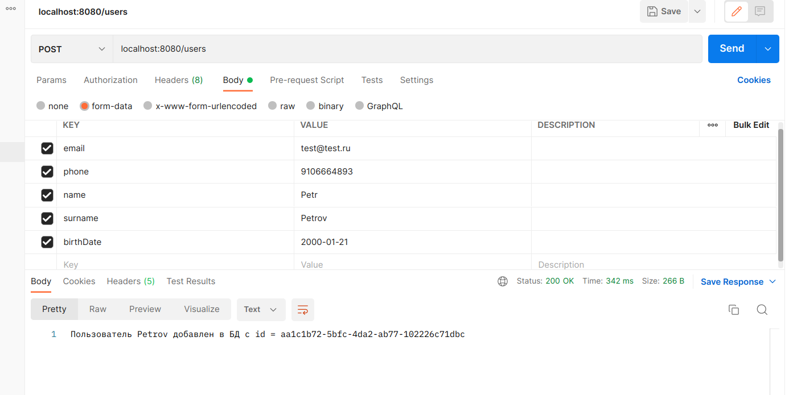
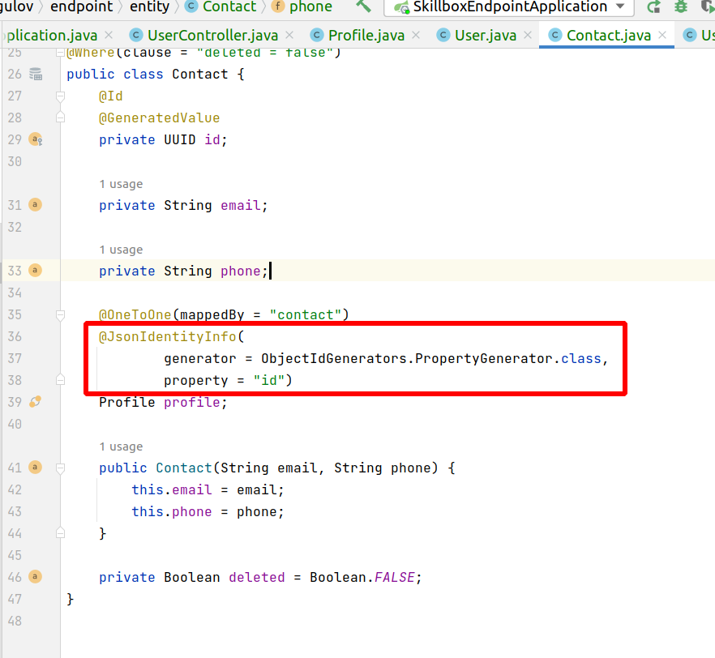
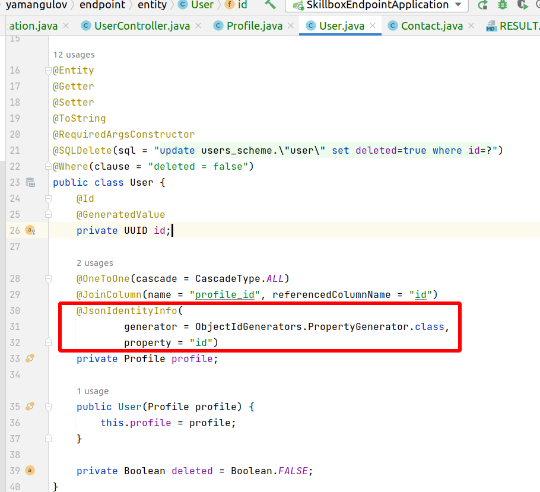
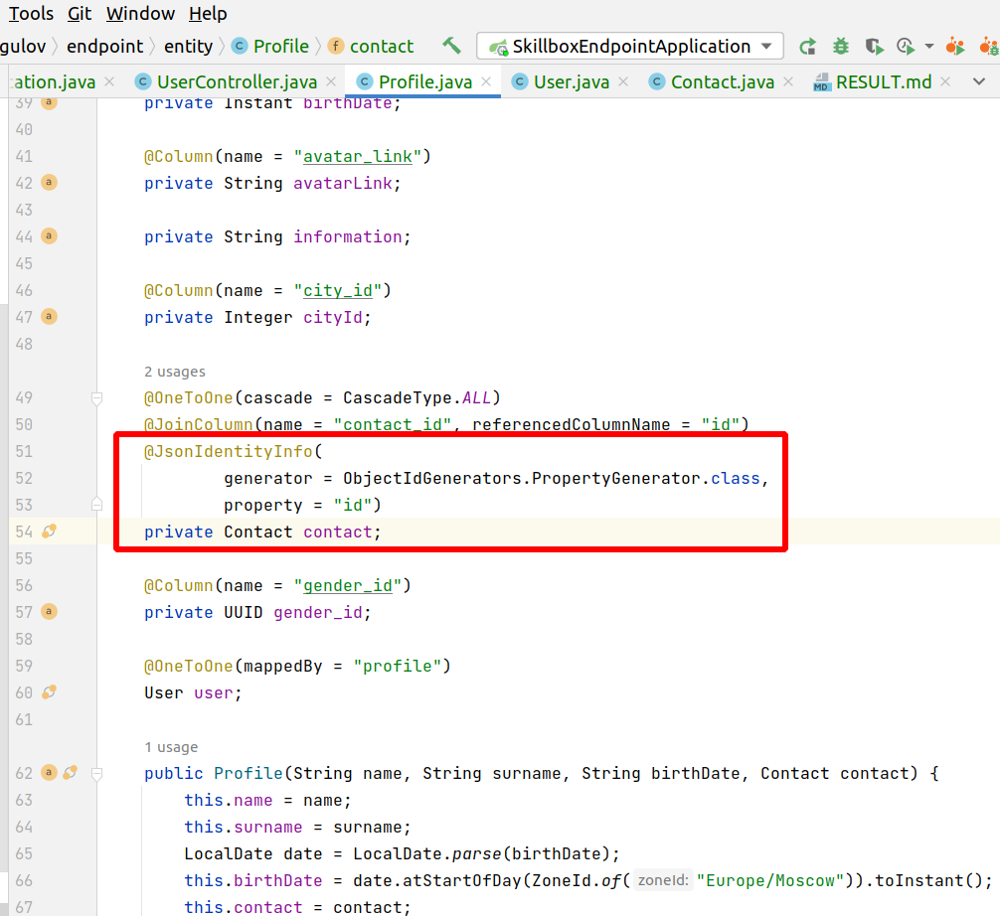
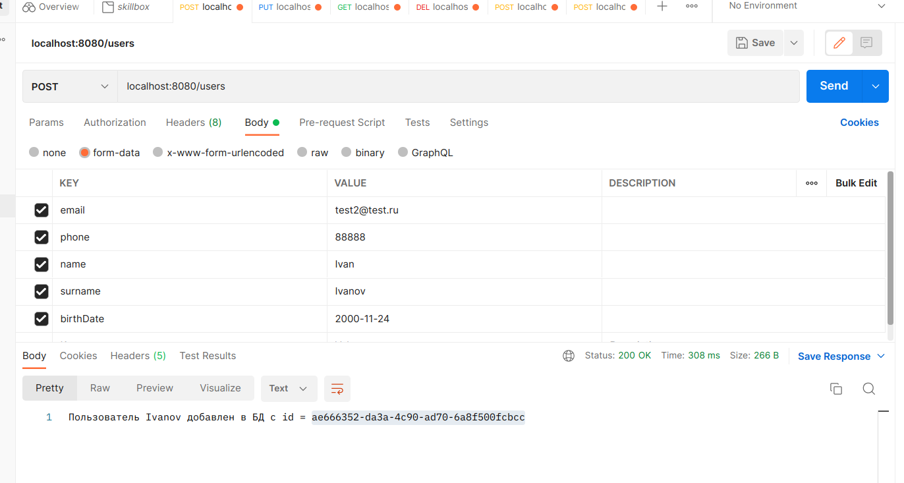
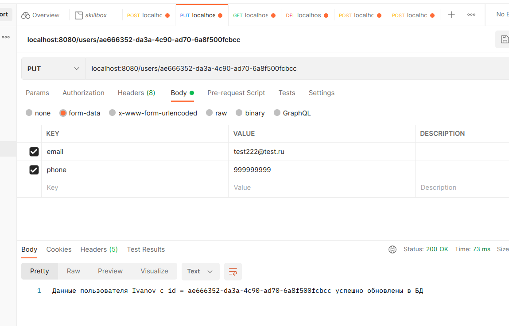
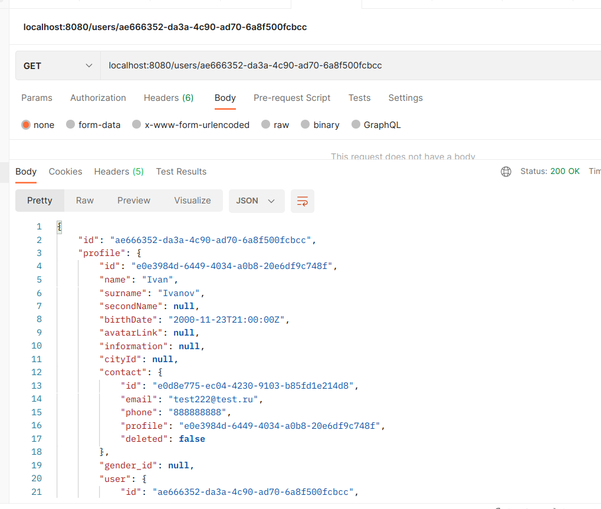
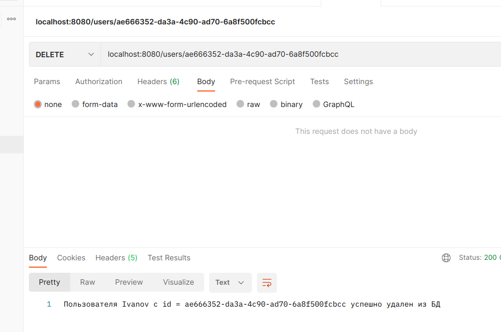
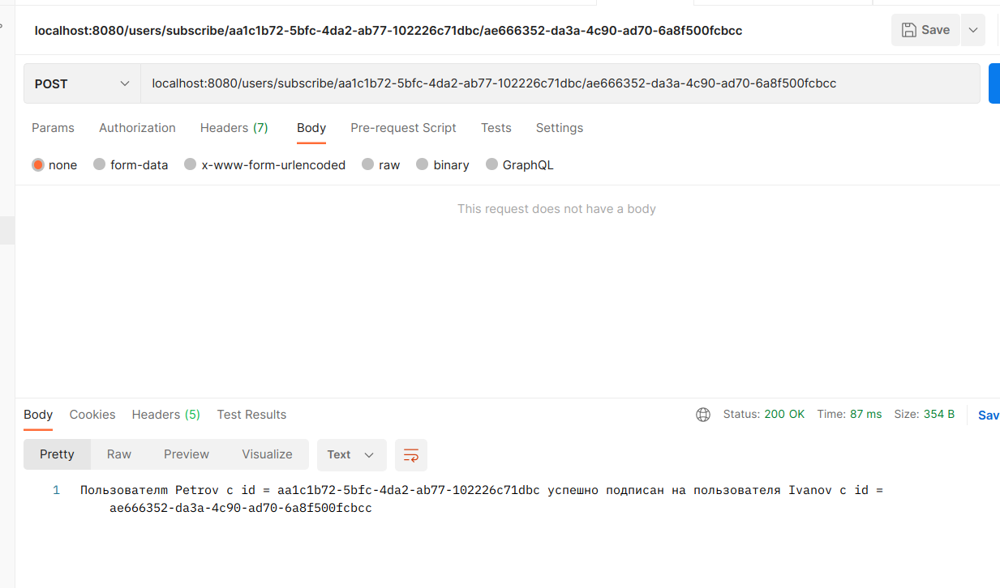
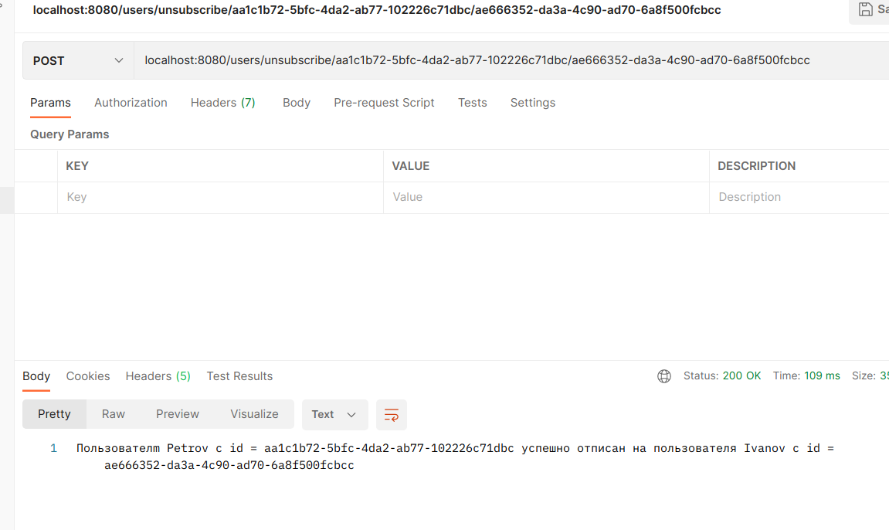

При решении задачи воспользуемся доменной моделью и БД, созданными в предыдущих задачах.

Так как в моей доменной модели пользователь неразрывно связан с его профилем, а через профиль - с контактами, то для работы с пользователями в БД через Hibernate мне понадобилась не одна, а три сущности со связями @OneToOne - User, Profile и Contact. Иначе constraints, прописанные в БД не дадут корректно работать с пользователем. Также это приводит к необходимости передать в параметрах запроса данные, предназначенные не для одного класса, а для всех трех. Поэтому я использовал в контроллере в методе createUser аннотацию @RequestParam, а не @RequestBody, что требует, в свою очередь, чтобы при тестировании в Postman параметры передавались не в виде json в теле запроса, а в виде параметров post-запроса

В данном случае я просто упростил себе работу, чтобы не делать, например, отдельный слой data transfer в приложении, в котором бы создавался класс, включающий в себя параметры из всех трех классов User, Profile и Contact, с тем чтобы воспользоваться этим классом для того, чтобы в методе createUser с аннотацией @RequestBody создавался общий экземпляр такого data transfer класса, который затем парсился бы на три класса. Такой вариант тоже возможен и был бы работоспособным.

Но использование моей доменной модели вызывает еще сложности, например, метод контроллера getUser неизбежно приводит к закольцовке и бесконечному циклу из-за связанных сущностей. Чтобы избежать этого и получить адекватный ответ, необходимо добавить такую аннотацию во всех трех сущностях над полями, которые отрабатывают связи между ними:

Вообще, данное задание рассматривается в курсе, как простое, но это было бы при условии, что в нем была бы доменная модель попроще: данные пользователя хранились бы в одной сущности, а не в трех. Но я использовал именно более сложный вариант доменной модели, поэтому мое решение получилось посложнее. И этот вариант проистекает из задания, где мы должны были составить доменную [модель](domain.png) по условиям. И я добросовестно подстроился в данной задаче под нее, что будут делать и другие добросовестные студенты курса. Поэтому я бы очень рекомендовал поставить этой задаче статус "сложная", а также дополнить курс описанием, как работать именно с такими связанными полями в JPA. Мне удалось победить эту задачу только потому, что у меня уже есть опыт работы со Spring Data.

Проверил успешно работу с БД через Postman:

Также результаты всех этих действий я пошагово проконтролировал непосредственно в БД, просматривая таблицы через подключение к Data Source в Intellij Idea

